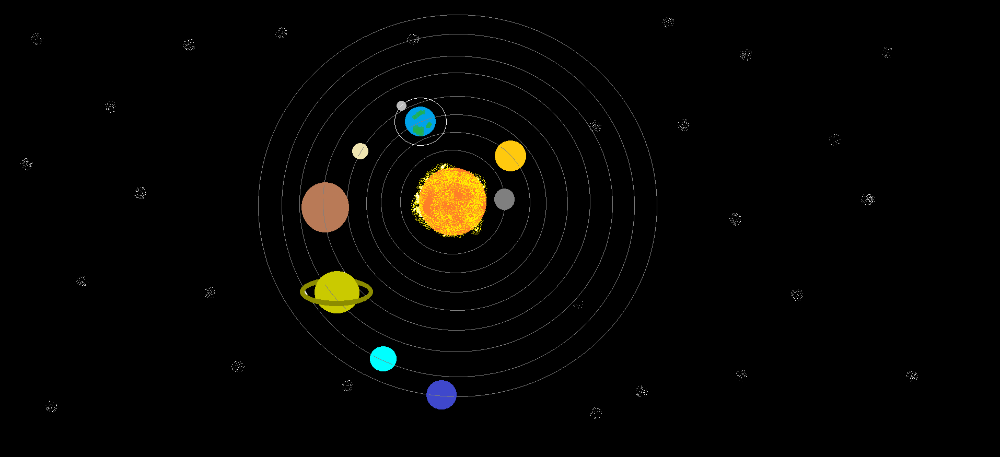

## Abstract o Idea:

La escena se centra en un sistema estelar compuesto por una estrella central y ocho planetas orbitando a su alrededor. Cada planeta presenta características únicas, incluyendo su propia velocidad de rotación, presencia de satélites o anillos, y una rotación sobre su propio eje. 

## Elementos que va a tener:

- **Estrella Central:** Una estrella que sirve como centro del sistema estelar.
- **Planetas:** Ocho planetas que orbitan alrededor de la estrella central. Cada planeta tiene su propio tamaño, masa, atmósfera, topografía y características únicas.
- **Satélites y Anillos:** Algunos planetas tienen satélites naturales o anillos que orbitan a su alrededor. 
- **Rotación Planetaria:** Cada planeta gira sobre su propio eje.
- **Velocidad de Rotación:** Los planetas tienen diferentes velocidades de rotación.

## Dibujo o Concepto:

